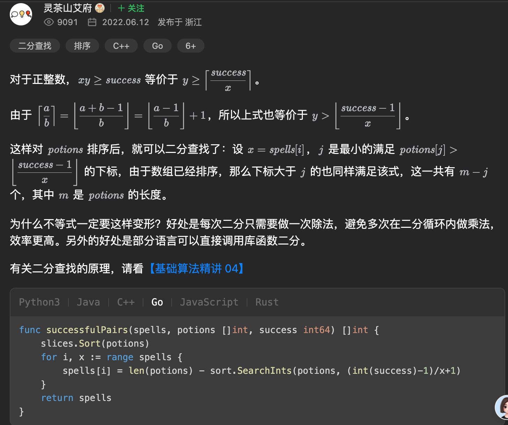

[2300. 咒语和药水的成功对数](https://leetcode.cn/problems/successful-pairs-of-spells-and-potions/)

给你两个正整数数组 `spells` 和 `potions` ，长度分别为 `n` 和 `m` ，其中 `spells[i]` 表示第 `i` 个咒语的能量强度，`potions[j]` 表示第 `j` 瓶药水的能量强度。

同时给你一个整数 `success` 。一个咒语和药水的能量强度 **相乘** 如果 **大于等于** `success` ，那么它们视为一对 **成功** 的组合。

请你返回一个长度为 `n` 的整数数组 `pairs`，其中 `pairs[i]` 是能跟第 `i` 个咒语成功组合的 **药水** 数目。

**示例 1：**

<pre><b>输入：</b>spells = [5,1,3], potions = [1,2,3,4,5], success = 7
<b>输出：</b>[4,0,3]
<strong>解释：</strong>
- 第 0 个咒语：5 * [1,2,3,4,5] = [5,<em><strong>10</strong></em>,<em><strong>15</strong></em>,<em><strong>20</strong></em>,<em><strong>25</strong></em>] 。总共 4 个成功组合。
- 第 1 个咒语：1 * [1,2,3,4,5] = [1,2,3,4,5] 。总共 0 个成功组合。
- 第 2 个咒语：3 * [1,2,3,4,5] = [3,6,<em><strong>9</strong></em>,<em><strong>12</strong></em>,<em><strong>15</strong></em>] 。总共 3 个成功组合。
所以返回 [4,0,3] 。</pre>

## [self](https://leetcode.cn/problems/successful-pairs-of-spells-and-potions/submissions/563985987)

```golang
func successfulPairs(spells []int, potions []int, success int64) []int {
    // 1. 先对 potions 进行排序
    sort.IntSlice(potions).Sort()
    // 2. 根据题目知道spells, potions都是正整数
    // 所以获取 success / spells[i] 对应的上取整字段，最小满足的整数，然后在 potions找
    ans := make([]int, len(spells))
    for index, x := range spells {
        target := (success / int64(x))
        if success % int64(x) != 0 {
            // 求余判断不能整除的就要向下取整
            target = target + 1
        }
        pos := lowerBound(potions, int(target))

        if pos == len(potions) {
            ans[index] = 0
            continue
        }

        ans[index] = len(potions) - pos
    }

    return ans
}


func lowerBound(nums []int, target int) int {
    left := -1
    right := len(nums)
    // 开区间 (left, right)
    for left + 1 < right {  // 区间不为空，继续轮询查询目标
        // right - left 防止溢出
        mid := left + (right - left) / 2
        /*
        循环不变量(即通过这次循环可以得知的具体不变的信息)
        nums[left] < target
        nums[right] >= target
        */
        if nums[mid] >= target {
            // 范围缩小到(left, mid)
            right = mid
        } else {
            // 范围缩小到(mid, right)
            left = mid
        }
    }

    // 此时 left 等于 right - 1
    // 因为 nums[right - 1] < target 且 nums[right] >= target，所以答案是 right
    return right
}
```

## [0x3f](https://leetcode.cn/problems/successful-pairs-of-spells-and-potions/solutions/1595712/by-endlesscheng-1kbp)



## 复杂度分析

- 时间复杂度： 二分 n 次，每个 O(log m)，potions 排序 O(m log m)，-> O(n+m)lom m
- 空间复杂度：O(1)，忽略排序的桟开销，仅用到若干额外变量
